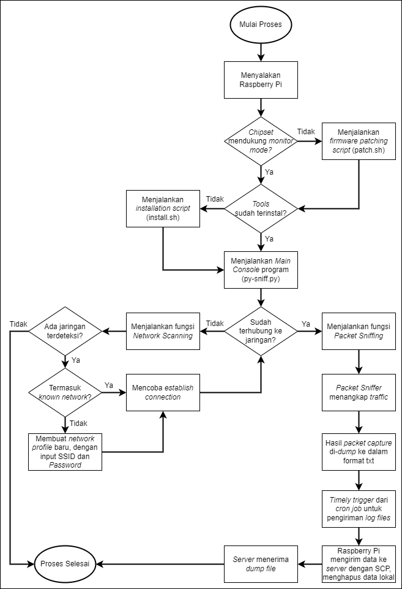
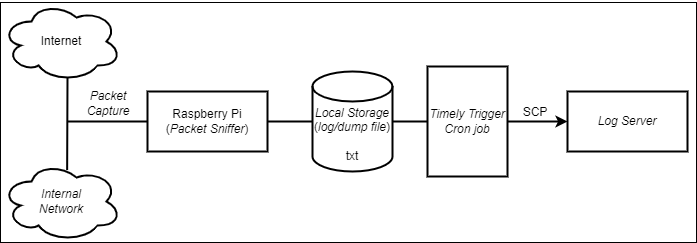

# Python Packet Sniffer
### Author: Gregorius Evangelist W. / 140810190040


This repository contains a Packet Sniffer program and documentation developed using the Python language and intended for use on Raspberry Pi. Submitted by the author as a research project for the Final Project in Computer Science at Universitas Padjadjaran.


## Description
A Packet Sniffer is a tool (either software or hardware) that can be used to capture network packets in a process known as packet capture. The use of a Packet Sniffer typically reveals packet headers and various other information that can be used to understand network behavior or configuration. This information is valuable for tasks such as network monitoring, security testing, and actual security attacks.

In this research, the Packet Sniffer is developed using the Python language, specifically for socket programming domain, with the following utilities:
* Available Network Scanning
* Network Connection/Profile Configuration - Establishment
* Main Packet Sniffing Function
* Packet Sniffing Result Parsing
* Packet Capture Dumping
* Sending Log Files to a Remote Server


## Documentation Section
To simplify repository navigations, use these buttons:
<p>
    <a style="margin-right: 15px;" href="https://github.com/ge-wijayanto/python-sniffer#program-design">
        
    </a>
    <a style="margin-right: 15px;" href="https://github.com/ge-wijayanto/python-sniffer#installation">
        
    </a>
    <a style="margin-right: 15px;" href="https://github.com/ge-wijayanto/python-sniffer#usage-guide">
        
    </a>
    <a style="margin-right: 15px;" href="https://github.com/ge-wijayanto/python-sniffer#demo">
        
    </a>
</p>


## Program Design
### Flowchart

### Topology



## Installation
```sh
git clone https://github.com/ge-wijayanto/python-sniffer
cd python-sniffer
chmod +x install.sh
./install.sh
```


## Usage Guide
```
# Start Main Console
sudo python3 py-sniff.py

usage: runprog.py [-h] [-nS] [-c] [-s]

py-sniff - A Python Packet Sniffer

optional arguments:
  -h, --help      show this help message and exit
  -nS, --netscan  Scan for available networks
  -c, --connect   Connect to a network
  -s, --sniff     Start packet sniffing function

########### USAGE EXAMPLE ###########

# Step 1: Run Main Console Program in Console
$ sudo python3 py-sniff.py

# Step 2: Input the Desired Commands in Main Console Prompt
## Network Scan
py-sniff > -nS  # or --netscan

## Connect to a Network
py-sniff > -c   # or --connect

## Start Packet Sniffing
py-sniff > -s   # or --sniff
```


## Demo
### Installation Process
Installation Video
### Main Console
Main Console Video
### Available Network Scanning & Establishing Connection
Network Scanning & Establish Connection Video
### Sniff All Network Traffic
Sniff All Traffic Video
### Sniff Specific Network Port
Sniff by Port Video
### Send Log, Clear Log, & Add Cron Job Scripts
Configurations Video
### Check Log Existence in Remote Server
Remote Server Video